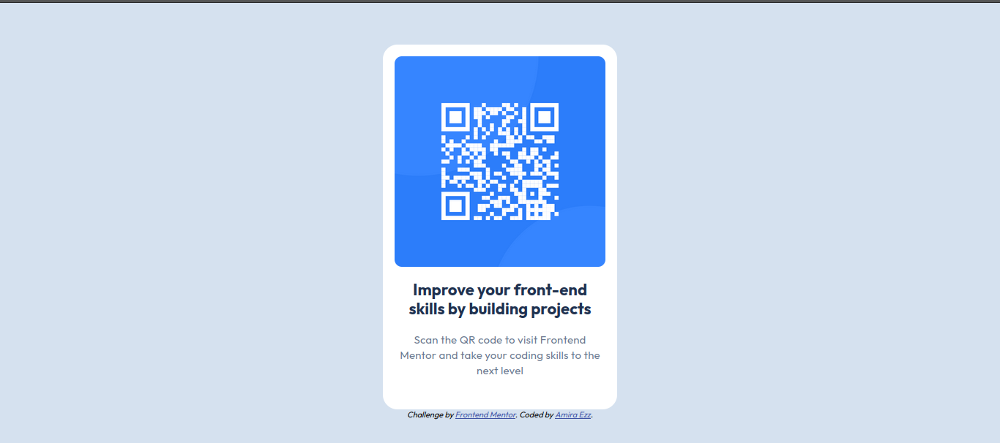
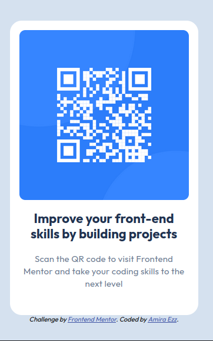
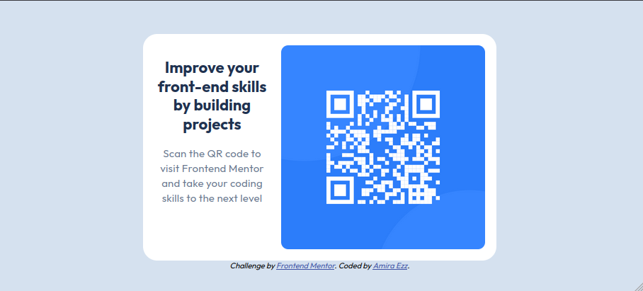

# Frontend Mentor - QR code component solution

This is a solution to the [QR code component challenge on Frontend Mentor](https://www.frontendmentor.io/challenges/qr-code-component-iux_sIO_H). Frontend Mentor challenges help you improve your coding skills by building realistic projects. 

## Table of contents

- [Frontend Mentor - QR code component solution](#frontend-mentor---qr-code-component-solution)
  - [Table of contents](#table-of-contents)
  - [Overview](#overview)
    - [Screenshot](#screenshot)
      - [Desktop](#desktop)
      - [Mobile (Portrait view)](#mobile-portrait-view)
      - [Mobile (landscape view)](#mobile-landscape-view)
    - [Links](#links)
  - [My process](#my-process)
    - [Built with](#built-with)
    - [What I learned](#what-i-learned)
    - [Continued development](#continued-development)
    - [Useful resources](#useful-resources)
  - [Author](#author)
  - [Acknowledgments](#acknowledgments)

## Overview

### Screenshot
#### Desktop

#### Mobile (Portrait view)

#### Mobile (landscape view)

### Links

- Solution URL: [GitHub Repo](https://github.com/dev-amira-ezz/qr-code-component)
- Live Site URL: [Live Preview](https://dev-amira-ezz.github.io/qr-code-component/)

## My process

### Built with

- Semantic HTML5 markup
- CSS custom properties
- Flexbox
- Mobile-first workflow

### What I learned

- I learned to use a Figma design and convert it into an HTML/CSS project.
- I learned to checking the responsiveness of my project on FireFox and adjust my code accordingly.
- I found out that the `position: absolute;`solution was not responsive, so I used flexbox instead to center the component in the page.
- On small devices the content of the component was cut off and some of it was not seen. So, I created a special layout where I arranged items horizontally using flexbox `flex-direction: row-reverse`.
- I used semantic elements like `article`, `section`, `footer` and also used `arialabeledby` with the section element to make sure the component is accessible.
- I used global variables so that the colors can easily be changed in the future.
- I learned how to embed google fonts in the project.

### Continued development

Use this section to outline areas that you want to continue focusing on in future projects. These could be concepts you're still not completely comfortable with or techniques you found useful that you want to refine and perfect.

**Note: Delete this note and the content within this section and replace with your own plans for continued development.**

### Useful resources

- [Example resource 1](https://www.example.com) - This helped me for XYZ reason. I really liked this pattern and will use it going forward.
- [Example resource 2](https://www.example.com) - This is an amazing article which helped me finally understand XYZ. I'd recommend it to anyone still learning this concept.

**Note: Delete this note and replace the list above with resources that helped you during the challenge. These could come in handy for anyone viewing your solution or for yourself when you look back on this project in the future.**

## Author

- Website - [Add your name here](https://www.your-site.com)
- Frontend Mentor - [@yourusername](https://www.frontendmentor.io/profile/yourusername)
- Twitter - [@yourusername](https://www.twitter.com/yourusername)

**Note: Delete this note and add/remove/edit lines above based on what links you'd like to share.**

## Acknowledgments

This is where you can give a hat tip to anyone who helped you out on this project. Perhaps you worked in a team or got some inspiration from someone else's solution. This is the perfect place to give them some credit.

**Note: Delete this note and edit this section's content as necessary. If you completed this challenge by yourself, feel free to delete this section entirely.**
