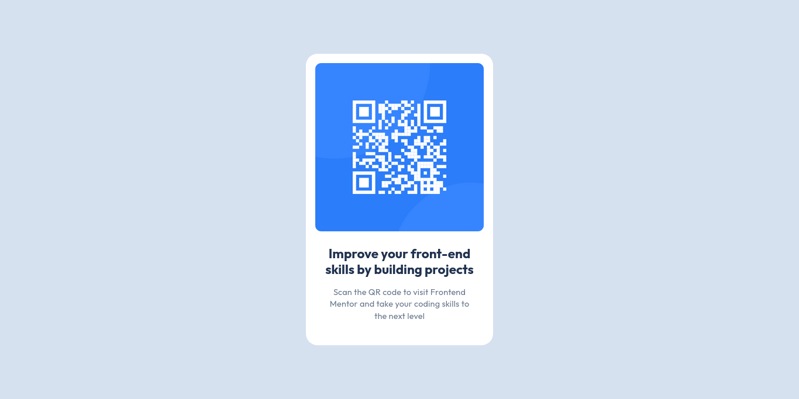

# Frontend Mentor - QR code component solution

This is a solution to the [QR code component challenge on Frontend Mentor](https://www.frontendmentor.io/challenges/qr-code-component-iux_sIO_H). Frontend Mentor challenges help you improve your coding skills by building realistic projects.

## Table of contents

- [Overview](#overview)
  - [Screenshots](#screenshots)
  - [Links](#links)
- [My process](#my-process)
  - [Built with](#built-with)
  - [What I learned](#what-i-learned)
  - [Continued development](#continued-development)
- [Author](#author)

## Overview

### Screenshots

- Desktop:  
  
- Mobile:  
  

### Links

- Solution URL: [Solution URL](https://github.com/dev-amira-ezz/qr-code-component)
- Live Site URL: [Live site URL](https://dev-amira-ezz.github.io/qr-code-component/)

## My process

### Built with

- Semantic HTML5 markup
- CSS variables
- Flexbox
- Mobile-first workflow

### What I learned

- To use the Figma design as a guide for padding and margins, while using rem to set them.
- To reset some of the default features of HTML elements in order to work smoothly.
- Flexbox is a very good way of styling a card or a small component.

### Continued development

- Grab ready-made resets to start fresh with my CSS code.
- Learn more about variable naming best practices.

## Author

- Frontend Mentor - [@dev-amira-ezz](https://www.frontendmentor.io/profile/dev-amira-ezz)
- X - [@AmiraEzz4007](https://x.com/AmiraEzz4007)
